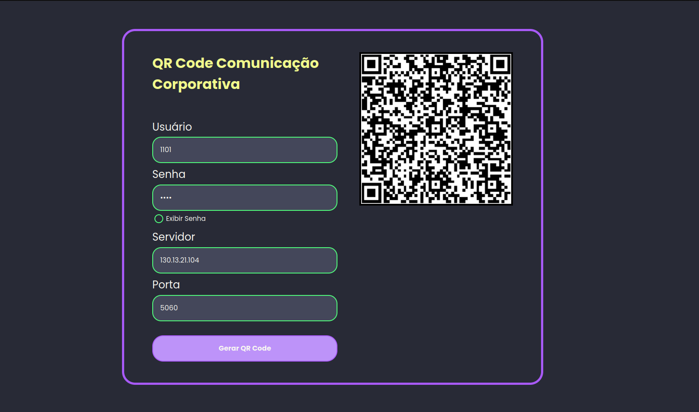

# React QRCode Form

A modern, containerized **React** form application built with **Vite**, **SCSS modules**, and **Docker**. Collects user input, generates a QR code, and sends data to a backend API (with optional encryption). Designed for easy development and production deployment.



---

## 🚀 Features

- **Vite + React 18**: Fast cold starts and HMR in development.
- **SCSS Modules**: Scoped, maintainable styles with a global variables file.
- **Context API**: Shared form state via `FormContext`.
- **Dynamic Form Sections**: Break your form into reusable `<FormSection />` and `<InputField />` components.
- **API Integration**: `apiService.js` to POST form data.
- **Optional Encryption**: `encryptionService.js` to encrypt payloads before send.
- **Dockerized**: Production-ready Dockerfile + `docker-compose.yml`.

---

## 📦 Tech Stack

- **Framework**: React 18 + Vite
- **Styling**: SCSS Modules
- **State**: React Context
- **Bundler**: Vite
- **Containerization**: Docker & Docker Compose
- **Serving**: `serve` (static production server)
- **Node**: v20 (Alpine images)

---

## 📁 Project Structure

```
├── public/
│ └── vite.svg
├── src/
│ ├── assets/
│ ├── components/
│ │ ├── FormPage/
│ │ │ ├── FormPage.jsx
│ │ │ └── FormPage.module.scss
│ │ ├── FormSection/
│ │ │ ├── FormSection.jsx
│ │ │ └── FormSection.module.scss
│ │ └── InputField/
│ │ ├── InputField.jsx
│ │ └── InputField.module.scss
│ ├── context/
│ │ └── FormContext.jsx
│ ├── services/
│ │ ├── apiService.js
│ │ └── encryptionService.js
│ └── styles/
│ └── variables.scss
├── .dockerignore
├── docker-compose.yml
├── docker-compose.dev.yml
├── Dockerfile
├── index.html
├── package.json
├── vite.config.js
└── README.md
```
---

## 🛠️ Prerequisites

- [Node.js ≥ 20](https://nodejs.org/)
- [Docker](https://www.docker.com/) & [Docker Compose](https://docs.docker.com/compose/)
- Git (to clone this repo)

---

## ⚙️ Local Development (without Docker)

1. **Install dependencies**  
```bash
npm install
```
2. **Start Vite dev server**
```bash
npm run dev
```
3. **Build and Preview**
```bash
npm run build
npm run preview
```
## 🐳 Development with Docker
* **Use the dedicated Compose file to build the Docker:**
```bash
docker-compose up --build -d
```
* run this only in the first build
* opens at http://localhost:3000

---
### Built with ❤️ by Luan Weber 

### Feel free to ⭐️ this repo if you found it helpful!